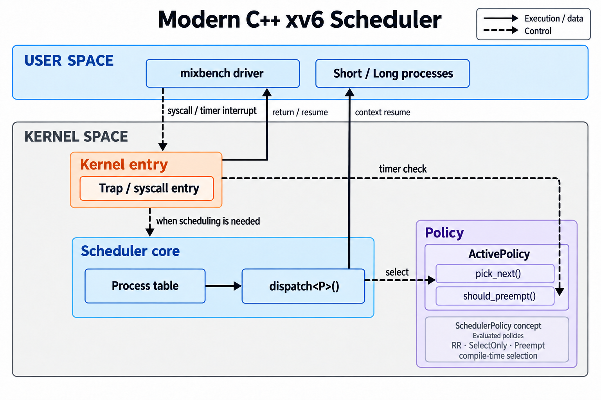

# Modern xv6 OS

**Applying Modern C++ to OS Design and Evaluation**

Modern C++로 xv6의 정책 인터페이스와 자원 소유권을 명시적으로 표현하고, 그 실행 비용·안전성·스케줄링 효과를 분리해 평가한 프로젝트다.

2025년 3월 스페인 UC3M(Leganés) 교환학생 기간에 들은 Bjarne Stroustrup의 Contemporary C++ 강연에서 출발했다. “현대 C++를 운영체제에 적용하면 무엇이 좋아지는가?”라는 질문을 구현과 대조 실험으로 구체화했다.

| 에피소드 | 연구 질문 |
|---|---|
| **Ep1 · Modern C++ Abstractions: Cost and Resource Safety** | 정책 분리와 소유권 표현은 어떤 오류를 예방하며, 실행 비용은 얼마인가? |
| **Ep2 · Scheduling Policies in Modern C++: Latency and Trade-offs** | 우선순위 정책은 짧은 작업의 응답시간을 줄이며, 그 대가는 무엇인가? |

**Ep1은 언어·추상화의 비용을, Ep2는 정책의 효과를 다룬다.** 명령어 수 감소를 실행시간 감소로, 정책에 의한 응답 개선을 C++ 자체의 효과로 해석하지 않는다.

## 목차

1. 구현 구조와 평가 범위
2. Ep1 — Modern C++ Abstractions: Cost and Resource Safety
   - 1A. 정책 추상화의 실행 비용
   - 1B. 자원 소유권과 RAII
3. Ep2 — Scheduling Policies in Modern C++: Latency and Trade-offs
   - Stage A: 계측 파일럿
   - Stage B: 정책 비교
   - Stage C: 측정 간섭과 icount 재현성
4. 시행착오와 검증
5. 결론과 후속 질문
6. 실행과 근거 자료
7. 기반 프로젝트와 라이선스

## 1. 구현 구조와 평가 범위



*주요 관계를 나타낸 개념도다. 드라이버뿐 아니라 short/long 프로세스도 trap·syscall 경로로 커널에 진입한다.*

스케줄러 공통 실행부와 정책 선택 로직을 분리했다. SchedulerPolicy concept가 정책 인터페이스를 검사하고, `dispatch<P>()`가 빌드에서 선택한 정책 타입을 사용한다. pick_next()는 실행 대상을, should_preempt()는 해당 타이머 경로에서 양보할지를 결정한다.

- [정책 인터페이스](kernel/sched_policy.hpp) · [공통 실행부](kernel/scheduler.cpp)
- [자원 소유권 객체](kernel/unique_page.hpp)
- [혼합 워크로드 드라이버](user/mixbench.c)

컴파일타임에 정책 타입을 결합하지만, 원본 C 구현도 직접 호출을 컴파일할 수 있다. **컴파일타임 결합 자체가 C++만의 속도 우위는 아니다.**

Episode 2의 비교 대상은 RR, SelectOnly, Preempt다. 저장소의 FCFS는 FIFO 선택과 타이머 선점을 조합한 구현으로 이번 비교에 포함하지 않았으며, CFS도 평가하지 않았다.

실험은 QEMU 단일 코어 조건을 중심으로 수행했다. Ep1의 instret는 실행된 명령어 수, Ep2의 tick은 커널 타이머 단위다. 실제 하드웨어의 사이클·마이크로초 지연이나 전체 OS 성능을 직접 측정한 결과는 아니다.

## 2. Ep1 — Modern C++ Abstractions: Cost and Resource Safety

### 1A. 정책 추상화의 실행 비용

첫 실험은 같은 C++ 벤치마크에서 정적 템플릿과 함수 포인터 호출을 비교했다. 이후 **동일한 RR 알고리즘의 직접 C 구현**을 추가해 언어와 호출 조건을 분리했다.

GCC 14 계열의 gcc/g++, 동일 타겟·공통 최적화 `-O`, CPUS=1, `-icount shift=0`, 200회 반복을 사용했다. 아래 RR 비용은 마지막 슬롯만 RUNNABLE인 탐색 조건이다.

| 비교 대상 | total instret / 반복 수 | 평균 instret |
|---|---:|---:|
| 단순 본문 · static | 404 / 200 | 2.020 |
| 단순 본문 · 함수 포인터 | 2,807 / 200 | 14.035 |
| RR · 직접 C, out-of-line | 106,405 / 200 | **532.025** |
| RR · C++ 템플릿, noinline | 106,405 / 200 | **532.025** |
| RR · 함수 포인터 | 106,607 / 200 | 533.035 |
| RR · C++ 인라이닝 허용, opaque n | 103,411 / 200 | 517.055 |

직접 C와 C++ noinline 구현은 관측한 명령어 시퀀스가 재배치 대상 심볼을 제외하고 같았으며 total도 일치했다. 빈 RUNNABLE 집합, 흩어진 세 작업의 순환, 상태 변화에 따른 wrap에서도 선택 결과와 last 갱신을 대조했다. 이 검증은 의미적 일치를 보완하며, 모든 입력의 비용이 532.025라는 뜻은 아니다.

인라이닝 허용 구현과의 차이는 **14.970 instret**다. 호출·반환뿐 아니라 레지스터 배치와 루프 최적화 등 생성 코드 차이가 포함된다. 상수 n을 노출한 별도 조건은 707.040 instret로, 템플릿이 항상 함수 포인터보다 적은 명령어를 사용한 것도 아니다.

원본 스타일 선형 탐색을 각색한 보조 실험은 258.030 instret였다. 그러나 락·문맥 전환을 제거하고 첫 일치에서 반환하도록 바꾼 루프이며, 현재 RR과 탐색 시작점·순환 주소 계산이 다르다. **원본 xv6 스케줄러 전체와 C++ 스케줄러의 직접 성능 비교로 사용하지 않는다.** 순환 탐색에 모듈로 연산이 반드시 필요한 것도 아니다.

> 측정한 조건에서 동일한 탐색 알고리즘을 C++ 정책으로 분리했을 때, 직접 C 구현 대비 추가 실행 명령어 비용이 관측되지 않았다.

근거: [A/B/C 원시 로그](docs/bench/dispatch_bench_episode1_abc_icount_cpus1.txt), [디스어셈블리](docs/bench/asm_episode1_abc_pick_next.txt), [원본 스타일 탐색 대조](docs/bench/dispatch_bench_vanilla_vs_cpp_icount_cpus1.txt).

### 1B. 자원 소유권과 RAII

다음 질문은 **“어떤 실수를 구조적으로 줄이며 그 비용은 얼마인가?”**였다.

`UniqueResource<AcquireFn, FreeFn>`는 자원 하나를 소유하는 작은 비복사 객체다. 실제 페이지용 UniquePage, 원장 검사용 TestUniquePage, 고정 슬롯용 UniqueSlot이 같은 템플릿 소스를 공유한다. 백엔드가 다르므로 생성 코드까지 같다고 가정하지 않는다.

| 연산 | 소유권 계약 |
|---|---|
| acquire() | 백엔드에서 획득, 실패하면 빈 객체 |
| 이동 생성 | 소유권을 옮기고 원본을 비움 |
| 소멸 | 소유 중이면 정상적인 스코프 종료에서 해제 |
| get() | 소유권을 넘기지 않는 raw 포인터 접근 |
| release() | 객체를 비우고 호출자에게 해제 책임 이양 |
| 복사·이동 대입 | 삭제; 임의 raw 포인터를 받는 공개 생성자도 없음 |

기존 allocator 내부나 mmap·스케줄러를 바꾸지 않은 **격리된 벤치마크**다. 운영체제 전체가 RAII로 전환된 상태는 아니다.

#### 정확성부터 검증

A(C 수동 해제), B(C++ 수동 해제), C(C++ RAII)를 같은 할당·반환 계약과 역순 해제 조건으로 비교했다.

- 세 조건 × 1차 할당 실패·2차 할당 실패·명시적 조기 실패·성공 후 이양: **12건 PASS**.
- 이동 생성 후 원본 비움과 최종 해제: **PASS**.
- 원장이 누수·중복 해제와 함께 **ALLOC(a) → ALLOC(b) → FREE(b) → FREE(a)** 순서까지 검사.
- 해제 누락·중복 해제를 주입해 **검사 장치가 실제로 탐지함을 확인**. 중복 해제는 실제 kfree() 전에 차단.
- 복사 시도와 잘못된 정책 인터페이스는 컴파일 실패, 이동 생성과 유효 RR 정책은 컴파일 성공.

컴파일 실패 검사는 일부 금지 연산을 확인한 것이며 가능한 모든 소유권 오용을 증명한 것은 아니다.

#### 실행 비용과 코드 크기

세 진입점은 모두 out-of-line이며 GCC 14 계열 C/C++ 컴파일러와 같은 공통 최적화·타겟을 사용했다. C++ 전용 옵션은 별도로 적용했다. 원장·오류 주입·출력은 timed 경로에서 제외했다.

새 부팅 3회에 ABC/BCA/CAB 순서로 실행했다. 각 케이스는 200회 반복했으며 아래 값은 세 부팅에서 동일했다. 실제 allocator 비용과 고정 슬롯의 소유권 메커니즘 비용은 별도로 해석한다.

| 백엔드·경로 | A: C 수동 (total / 200) | B: C++ 수동 (total / 200) | C: RAII (total / 200) |
|---|---:|---:|---:|
| real · success | 10,024,804 / 200 = **50124.020** | 10,024,804 / 200 = **50124.020** | 10,024,604 / 200 = **50123.020** |
| real · early_fail | 10,024,604 / 200 = **50123.020** | 10,024,604 / 200 = **50123.020** | 10,024,804 / 200 = **50124.020** |
| fake · success | 27,804 / 200 = **139.020** | 27,804 / 200 = **139.020** | 27,604 / 200 = **138.020** |
| fake · early_fail | 27,604 / 200 = **138.020** | 27,604 / 200 = **138.020** | 27,804 / 200 = **139.020** |

평균 단위는 instret다. C−B는 success −1, early_fail +1이었다. 반복되는 차이를 “잡음”이나 “추상화와 무관한 차이”로 단정하지 않는다.

| 진입 함수 크기 (real/fake 공통) | A | B | C |
|---|---:|---:|---:|
| success | 92 B | 92 B | 94 B |
| early_fail | 94 B | 94 B | 104 B |

해당 진입 함수의 정적 크기이며 전체 커널 크기 증가량은 아니다. 관측한 실행 순서들에서 비용 차이는 없었지만 모든 환경에서 순서 편향이 없음을 보장하지는 않는다.

#### 확보한 안전성과 남은 책임

RAII는 정상적인 스코프 종료와 조기 반환에서 해제를 자동화했고 복사를 차단했다. 2차 할당 실패 시 첫 자원 정리, 두 자원 획득 후 조기 실패 시 역순 정리를 소멸자가 수행한다.

반면 get()의 별칭 유출, release() 이후의 이중 해제, panic·비지역 종료·문맥 전환을 가로지르는 수명은 해결하지 않는다. 유지보수 측면의 근거는 **수동 정리 분기를 줄이고 소유권 계약을 코드에 표현했다는 것**이며, 개발 시간이나 결함률을 정량 평가하지는 않았다.

> 측정한 조건에서 RAII는 작은 실행 명령어 차이와 코드 크기 증가를 보이면서, 정상적인 스코프 종료와 조기 반환에서 자원 해제를 자동화했다. 복사 금지로 일부 소유권 오용도 차단했지만, 별칭 유출이나 명시적 소유권 이양 이후의 오용까지 예방하지는 않는다.

근거: [ABC](docs/bench/ep1_resource/ep1_resource_round1_ABC_icount_cpus1.txt) · [BCA](docs/bench/ep1_resource/ep1_resource_round2_BCA_icount_cpus1.txt) · [CAB](docs/bench/ep1_resource/ep1_resource_round3_CAB_icount_cpus1.txt), [코드 크기](docs/bench/ep1_resource/code_sizes.txt), [컴파일 검사](docs/bench/ep1_resource/negative_tests_build.log), [회귀 검사](docs/bench/ep1_resource/ep1_resource_usertests_regression_raw.txt).

## 3. Ep2 — Scheduling Policies in Modern C++: Latency and Trade-offs

### 연구 질문

**짧은 작업을 우선 처리하면 응답시간이 줄어드는가? 그 대가로 전체 완료 시간과 긴 작업의 지연은 얼마나 증가하는가?**

short task 10개와 long task 2개를 고정된 도착 스케줄로 실행하고, 동일한 C++ 실행 구조에서 세 정책을 비교했다.

| 정책 | 선택 기준 | 사용자 모드 타이머 tick에서 |
|---|---|---|
| RR | RUNNABLE 작업 순환 선택 | 항상 양보 |
| SelectOnly | LatencySensitive 작업 우선 | 항상 양보 |
| Preempt | SelectOnly와 동일 | LatencySensitive 실행 유지 |

short 여부는 작업이 미리 선언한다. 실행 이력으로 작업 길이를 추정하는 정책은 이번 실험에 포함하지 않았다.

### 측정 방법

- **응답시간:** release → 사용자 코드 실행 재개
- **Makespan:** 공통 시작점 → 가장 늦은 작업 본문 완료
- **Long 완료 지연:** 각 long 작업의 release → 본문 완료
- **대기 지표:** 최대 runnable 대기시간
- **실험 유효성:** 레코드 정합성과 release jitter


### Stage A — 계측의 구조적 검증

정책 비교 전에 회귀 테스트와 RR 파일럿 2회를 수행했다. 레코드 누락·중복과 집계기 finding은 없었다.

두 실행 모두 short 응답 median **2 tick**, max **3 tick**, makespan **58 tick**이었다.

이는 정책 비교를 진행하기 위한 구조적 정합성 확인이다. 측정 간섭이 없음을 보장하는 결과는 아니다.

### Stage B — 응답 개선과 완료 지연

커널 재빌드 누락을 수정하고 정책별 바이너리 대응을 확인한 뒤, **5라운드 × 3정책**을 재실행했다. 사전 기준은 median ≥1 tick 개선(4/5 이상), short max ≤RR+1 tick, makespan ≤RR×1.10, long 지연 ≤RR×1.25였다. 비용 기준은 모든 라운드 충족을 요구했다.

| 평가 항목 | SelectOnly | Preempt |
|---|---:|---:|
| Short median ≥1 tick 개선 | 5/5 | 5/5 |
| Short max 방어 | 5/5 | 5/5 |
| Makespan ≤RR의 1.10배 | 1/5 | 1/5 |
| Long D0 ≤RR의 1.25배 | 4/5 | 4/5 |
| Long D6 ≤RR의 1.25배 | 4/5 | 4/5 |
| 종합 목표 | 미달 | 미달 |

두 정책 모두 short 응답 median이 **2→1 tick**으로 감소했다. 그러나 매 라운드 비용 기준을 충족해야 한다는 요건은 만족하지 못했다. 큰 지연이 관측된 실행도 제외하지 않았다.


### Stage C — 측정 과정도 다른 작업을 지연시키는가?

작업 본문이 끝난 뒤의 결과 수집도 다른 작업의 실행을 방해할 수 있었다. 공유 파일 수집에서 큰 release jitter를 관찰했고, 수집 전 우선순위 하향으로 정상 범위에 돌아오는 현상을 확인했다.

이후 세 수집 조건을 **5라운드 × 3정책 × 3조건, 총 45회** 비교했다.

| 조건 | 수집 방식 |
|---|---|
| V | 기존 즉시 콘솔 출력 |
| VD | 우선순위 하향 후 즉시 출력 |
| QD | 우선순위 하향 후 파이프 전달·회수 후 출력 |

45회 중 RR·V·round5에서 콘솔 레코드 손상을 발견했다. 드라이버는 run_valid=1을 출력했지만 외부 집계에서 무효로 판정했다. 원본은 보존하고 재시도하지 않았다. RR의 VD−V와 QD−V는 n=4, QD−VD는 n=5이며 다른 정책의 대조는 n=5다.

VD−V는 우선순위 하향, QD−VD는 동일 하향 조건에서 수집 방식 변경, QD−V는 전체 변경의 대조다. 대응 차이의 중앙값끼리는 일반적으로 더할 수 없다. QD에도 파이프 복사·시스템콜·종료 비용이 남는다.

수집 조건 간 short 응답 median·max 차이는 관측되지 않았다. 다른 작업의 수집이 아직 응답하지 않은 작업에 영향을 줄 수 있으므로, 이를 구조적으로 필연인 결과로 보지는 않는다. 다른 지표의 중앙값 차이는 작았지만 일부 라운드에는 큰 변동이 남았다. 이를 특정 syscall의 비용이나 확정된 원인으로 해석하지 않았다.


### icount — 보조 재현성 확인

일반 TCG와 분리해 QD 조건에서 정책별 3회씩 실행했다. 9회 모두 구조 검사와 도착 조건을 만족했고, 정책별 지표는 세 반복에서 동일했다.

| 지표 | RR | SelectOnly·Preempt |
|---|---:|---:|
| Short 응답 median / max | 2 / 3 | 1 / 1 |
| Makespan | 74 | 80 |
| Long D0 / D6 | 65 / 56 | 73 / 61 |

응답 개선과 완료 지연 증가의 방향은 같았다. 다만 makespan 증가율 **8.1%**, long 지연 증가율 **12.3%·8.9%**는 기존 참고 한계 안에 있었다.

SelectOnly와 Preempt의 관측 지표가 같다는 사실이 실행 경로의 동일성을 증명하지는 않는다. 이 표의 단위는 tick이며 실제 CPU 시간으로 해석하지 않는다.

시간 진행 조건에 따라 비용의 크기와 기준 충족 여부가 달라졌으므로, 일반 TCG와 합산하거나 Stage B의 판정을 대체하지 않았다.

## 4. 시행착오와 검증 과정

| 발견한 문제 | 대응 |
|---|---|
| 조건 이름과 실제 커널 정책의 불일치 | 빌드 절차 수정, 소스·해시·디스어셈블리 대응 확인 |
| 결과 수집이 드라이버 도착 제어를 지연 | 수집 우선순위 대조군 추가 |
| 공유 파일 수집의 간섭 | 용량이 제한된 공유 파이프 수집 구현 |
| 동시 콘솔 출력으로 레코드 손상 | 원본 보존, 별도 집계에서 탐지, 관련 대조 결측 처리 |
| 대응 대조의 표본 수 계산 오류 | 필요한 두 조건만으로 대조별 유효 표본 계산 |
| 자원 실험의 호출자 정리 누락·해제 순서 검사 부재 | 하네스와 원장 수정, 역순 해제 적용 후 3회 재측정 |

검증 과정에서 드러난 문제를 결과에서 숨기지 않고, **실행 완료·데이터 유효성·성능 기준 충족을 별도로 판단**했다.

## 5. 결론과 후속 연구

**Episode 1**에서는 동일한 RR 알고리즘의 직접 C와 C++ noinline 구현에서 추가 명령어 비용이 관측되지 않았다. 이어 RAII의 해제 자동화와 복사 차단을 검증하고, 측정 경로의 ±1 instret 차이와 진입 함수 크기 증가를 함께 기록했다.

**Episode 2**에서는 우선순위 정책의 short 응답 개선과 완료 지연 증가를 관찰했다. 또한 결과 수집과 시간 진행 조건이 성능 평가에 영향을 줄 수 있음을 확인했다.

Ep1은 단일 코어 QEMU에서의 명령어 수와 정적 코드 크기를, Ep2는 작은 고정 워크로드의 tick 단위 응답·완료 지연을 평가했다. 실제 데이터센터나 microsecond-scale 성능으로 일반화하지 않는다.

후속 연구 질문은 다음과 같다.

- 다른 자원에서도 소유권 오용 예방과 실행 비용을 함께 검증할 수 있는가?
- Budget·aging으로 응답 개선을 유지하면서 긴 작업 지연을 제한할 수 있는가?
- 실행 이력 기반 작업 분류가 명시적 우선순위 선언을 대신할 수 있는가?
- 더 짧은 시간 규모에서 평가하려면 어떤 실행 환경과 계측이 필요한가?

이 프로젝트를 통해 **정책 추상화 구현, 비용 분리 실험, 계측 오류 진단, 재현 가능한 성능 평가**를 경험했으며, 이를 바탕으로 스케줄링과 저지연 시스템 연구를 발전시키고자 한다.

## 6. 실행 방법

빌드는 GCC 14 RISC-V 크로스 툴체인과 C++23 커널 소스 기준으로 구성되어 있다. C++ 파일은 `-ffreestanding`, `-fno-exceptions`, `-fno-rtti`를 포함한 freestanding 제약으로 컴파일된다.

요구 사항:

- RISC-V GCC/G++ 14 크로스 툴체인
- QEMU >= 7.2

xv6 실행:

```bash
make qemu
```

스케줄러 계측 회귀 테스트(xv6 내부에서):

```
$ usertests -q
$ statstest
```

C++ 커널 파일에 대한 GCC 정적 분석:

```bash
make analyze
```

make qemu는 부팅 명령이며 모든 실험을 자동 재현하지 않는다. 정책·벤치마크 토글·CPU 수·QEMU 시간 조건은 각 빌드 로그와 manifest를 확인해야 한다. 자원 실험을 끈 CPUS=3 일반 TCG 회귀에서 PASS ALL TESTS를 확인했다.

Makefile은 위 벤치마크에 사용한 디스어셈블리·심볼 파일도 함께 생성한다. Episode 2의 원시 로그·집계 스크립트·manifest는 [`docs/bench/`](docs/bench/)에 보존되어 있다.

## 7. 기반 프로젝트와 라이선스

이 저장소는 MIT 6.1810 교육용 운영체제인 [MIT xv6-riscv](https://github.com/mit-pdos/xv6-riscv)를 기반으로 한다.

원본 xv6의 저작권과 라이선스는 [`LICENSE`](LICENSE)에 그대로 보존되어 있다.
